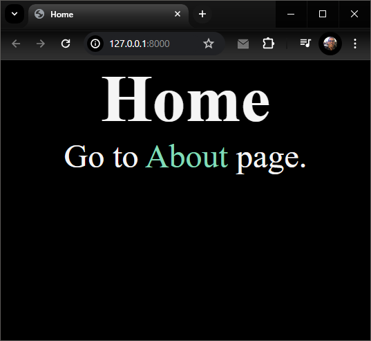
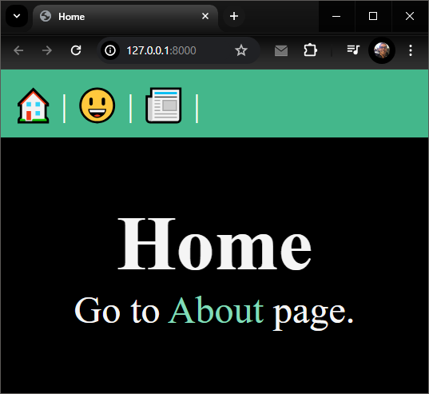
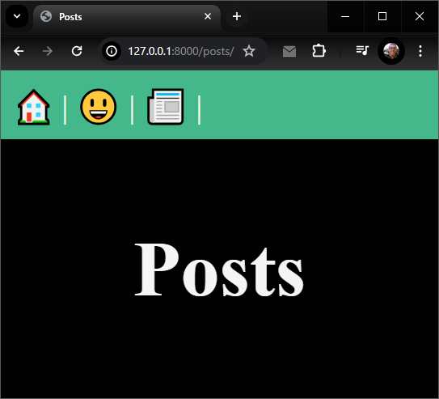

# [Dave Gray - Django Tutorials](https://www.youtube.com/playlist?list=PL0Zuz27SZ-6NamGNr7dEqzNFEcZ_FAUVX)

---

## Lesson 0:
- Project creation
- Rendering of html templates
- Config and use of paths and static files (css, js)

Create env (only the first time):

  ```py -m venv venv```

Activate env:

  ```source venv/Scripts/activate```

Install Django (only the first time):

    pip install django

Create a new Django project:

    django-admin startproject lesson0

Start app:

    cd lesson0

    py manage.py runserver

Visit App:

  - http://localhost:8000



---

## Lesson 1:
- App creation
- App configuration
- Using of namespaced templates
- VSCode Emmet configuration for Django HTML files
- Creation and use of "Base layout" template

Create a new Django app:

    py manage.py startapp posts

Add new 'posts' app to INSTALLED_APPS on settings.py

Add new 'templates/layout.html' file with `````` and  `````` placeholders

Update 'homepage.html' and 'about.html' to extends and use base layout by adding `````` and specifing blocks content.

Also add a new posts/templates/posts/posts.list.html file with ``````

Add posts/urls.py and update lesson1/urls.py to include the posts urls.

Start app:

    cd lesson1

    py manage.py runserver

Visit App:

  - http://localhost:8000
  - http://localhost:8000/about
  - http://localhost:8000/posts






