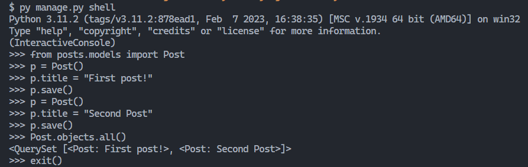
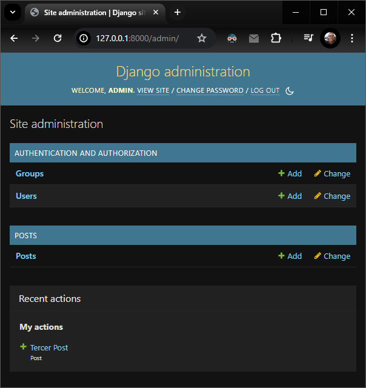
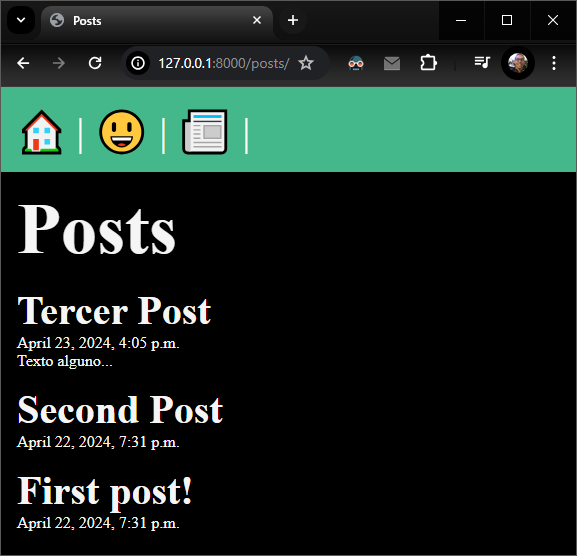
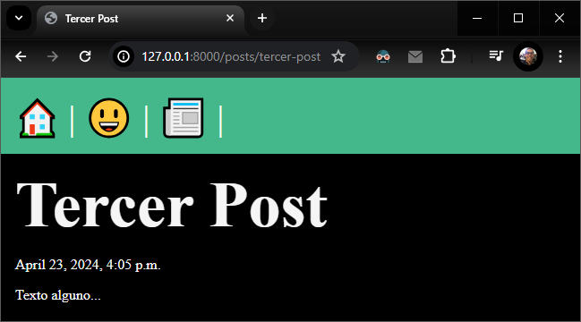
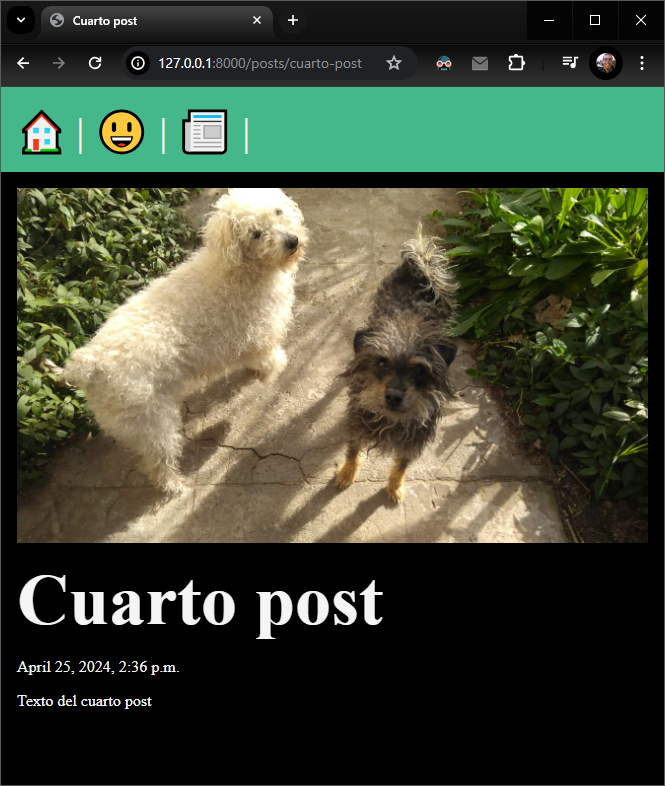
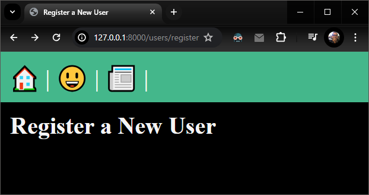

# [Dave Gray - Django Tutorials](https://www.youtube.com/playlist?list=PL0Zuz27SZ-6NamGNr7dEqzNFEcZ_FAUVX)

---

Note: To follow the tutorial playlist and make a new project for each lesson, I made a script called '_**clone_folder_and_increase_version.py**_' that creates a copy of the previous lesson folder and updates version numbers (in folders and files) accordingly (Thanks ChatGPT ♥)

---

## Lesson 0:
- Project creation
- Rendering of html templates
- Config and use of paths and static files (css, js)

Create env (only the first time):

  ```py -m venv venv```

Activate env:

  ```source venv/Scripts/activate```

Install Django (only the first time):

    pip install django

Create a new Django project:

    django-admin startproject lesson0

Start app:

    cd lesson0

    py manage.py runserver

Visit App:

  - http://localhost:8000

To render HTML templates, a 'view' function must be created in views.py file:

    def homepage(request):
      return render(request, 'homepage.html')

To use it, a 'path' must be specified in urls.py file, inside of 'urlpatterns' list:

    path('', views.homepage, name="homepage"),

By default Django will look for 'homepage.html' inside 'templates' folder in the root of the project.

Finally, to be able to use static files, the following code must be added to 'settings.py' file:

    import os # Add this at the top

    # Add this at the bottom of settings.py
    STATICFILES_DIRS = [
      os.path.join(BASE_DIR, 'static'),
    ]

  - Now, static files must be placed into '/static' root folder, and can be referenced from 'homepage.html' by using ' syntax':

      ```<link rel="stylesheet" href="">```

      ```<script src="" defer></script>```


---

## Lesson 1:
- App creation
- App configuration
- Using of namespaced templates
- VSCode Emmet configuration for Django HTML files
- Creation and use of "Base layout" template

Create a new Django app:

    py manage.py startapp posts

Add new 'posts' app to INSTALLED_APPS on settings.py

Add new 'templates/layout.html' file with `````` and  `````` placeholders

Update 'homepage.html' and 'about.html' to extends and use base layout by adding `````` and specifing blocks content.

Also add a new posts/templates/posts/posts.list.html file with ``````

Add posts/urls.py and update lesson1/urls.py to include the posts urls.

Start app:

    cd lesson1

    py manage.py runserver

Visit App:

  - http://localhost:8000
  - http://localhost:8000/about
  - http://localhost:8000/posts


---

## Lesson 2:

- Model and migrations

Create a class called Post inside posts/models.py (must inherit from models.Model)

Define fields (more info: https://docs.djangoproject.com/en/5.0/ref/models/fields/)

Apply base app migrations by running:

    py manage.py migrate

Create migration for new Post model:

    py manage.py makemigrations
  - A new 'posts\migrations\0001_initial.py' file will be created.

Apply migrations:

    py manage.py migrate
  - This creates Post model (_**table**_) on the database.


---

## Lesson 3:

- ORM Intro
- Adding **'\__str\__'** method to Post model to show post title whenever a post is shown:

      def __str__(self):
        return self.title

A quick way to try and play with the Django ORM is by using the shell this way:

    py manage.py shell

From there the Post model can be imported to perform several operations:

    from posts.models import Post

To create a Post object:

    p = Post()

To set values for the attributes:

    p.title = "First Post"
    p.body = "First Post body text"

Now the Post object can be saved into the database:

    p.save()

Finally it's possible to get all posts from the database:

    Post.objects.all()

  - Expected result:

      <QuerySet [<Post: First post>]>

To exit from the shell, execute:

    exit()




---

## Lesson 4:

- Django Admin Introduction
- Admin panel user creation
- Model registration to show it in admin panel
- Django ORM Post model used to retrive ordered posts
- Use of Python code in Jinja HTML templates to itereate and render posts

An user must be created to access to /admin panel:

      py manage.py createsuperuser

  - User created: admin
  - Password: admin123

- Posts can be manipulated by using the admin panel, but first it's requeried to "register" the Post model:
  - Add to '**_posts/admin.py_**', the following lines:


        from .models import Post
        admin.site.register(Post)

  - Next, access to http://localhost:8000/admin
    - A CMS web interface is available to manipulate (CRUD operations available) posts, users and groups.



- To show posts list, posts must be retrieved from the database by using Django ORM, and then passing it to the render method:

      def posts_list(request):
        posts = Post.objects.all().order_by('-date')
        return render(request, 'posts/posts_list.html', { 'posts': posts })
    - By using '-date' param, it will retrive posts in descending order.

- Finally, the HTML template must iterate the posts list to show the posts, it can be done by using a for loop:

      
        <article>
          <h2>{{ post.title }}</h2>
          <p>{{ post.date }}</p>
          <p>{{ post.body }}</p>
        </article>
      




---

## Lesson 5: Pages, URLs & Slugs

- URL path's names (aliases) and using URL name's on anchor tags
- Setting app_name to app url's file
- Using 'slug' Django path converter

Setting _**app_name**_ in _'\posts\urls.py'_ to be able to have the same url 'name' in different _**urls.py**_ app files.
  - To do this, just add a variable with the app name to _'posts/urls.py'_ app file:

        app_name = 'posts'

Setting name to an url path in _'\posts\urls.py'_:

    path('', views.posts_list, name="list")

  - Now, whenever an anchor tags is created, it can use app name and url name, like this:

    ```<a href="">Posts</a>```

Setting url path config in URL in '\posts\urls.py' for use of the post's 'slug':

    path('<slug:slug>', views.post_page, name="page"),

  - First 'slug' term tells Django and slug will be used in URL, second 'slug' term specify the Post model field which will be used as slug for creation of each Post URL.
  - #### Before this works, all posts must have slug field complete with some value like "my-first-post", "another-post", etc. ####

Finally, it's possible now to visit a specific post page specifing the post slug in URL, ex:
  - http://127.0.0.1:8000/posts/first-post

  


---

## Lesson 6: Upload & Display Images

- Update 'settings.py' adding at the bottom:

      MEDIA_URL = 'media/'
      MEDIA_ROOT = os.path.join(BASE_DIR, 'media')

- Create a 'media' root folder.
- Update main 'urls.py' to add:

      from django.conf.urls.static import static
      from django.conf import settings

      urlpatterns = [
        ... # Do not touch this part
      ]

      # Add this:
      urlpatterns += static(settings.MEDIA_URL, document_root=settings.MEDIA_ROOT)

- Install Pillow, that allows to use 'models.ImageFiled' in models:

      pip install Pillow

- Update Post model in 'posts/models.py', adding a new 'banner' field:

      banner = models.ImageField(default='fallback.png', blank=True)

- Make and execute migrations:

      py manage.py makemigrations
      py manage.py migrate

- Go to admin panel and update existing posts adding the value for the banner field (by default 'fallback.png' will be used for all posts)

- Make sure '/media' folder and 'media/fallback.png' file exists.

- Go to 'posts/templates/post_page.html' and add an img tag to show the image of the new 'banner' field

      

- Update CSS file '/static/css/styles.css' adding:

      .banner {
        display: block;
        width: 100%;
        max-width: 800px;
      }




---

## Lesson 7: Adding a new 'Users' app
- App creation:

      py manage.py startapp users

- App registration in 'lesson7/lesson7/settings.py':

      INSTALLED_APPS = [
          ... # Do not touch anything here
          'posts',
          'users' # <-- Add this line
      ]

- Add url path to users app in 'lesson7/lesson7/urls.py' file:

      path('posts/', include('posts.urls')), # <-- Below this line
      path('users/', include('users.urls')), # <-- Add this new line

- Adding a new route path in a new 'users/urls.py' file:

      app_name = 'users'

      urlpatterns = [
          path('register/', views.register, name="register"),
      ]

- Adding a new view for register page in 'users/views.py' file:

      def register(request):
        return render(request, 'users/register.html')

- Creating the register view HTML template in 'users/templates/users/register.html' which extends the base layout:

      

      
        Register a New User
      

      
        <h2>Register a New User</h2>
      


