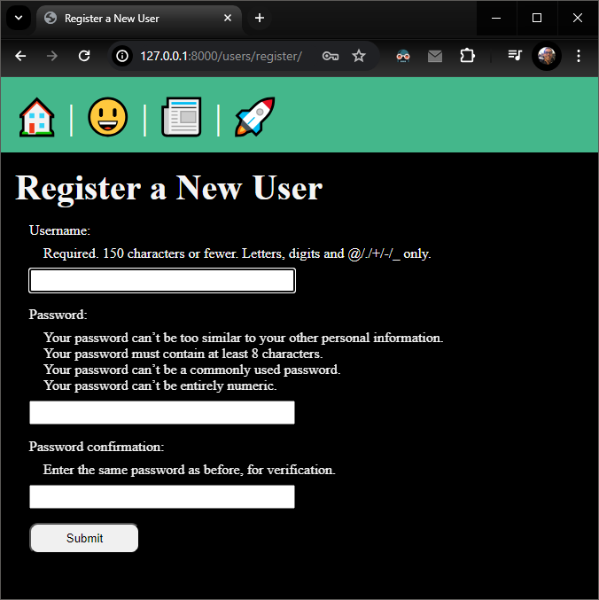
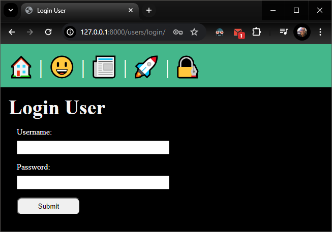
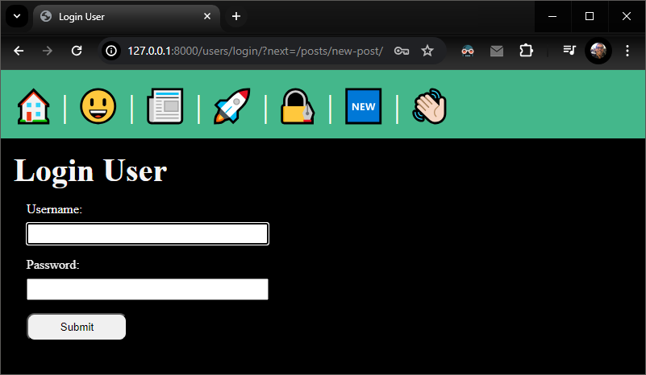
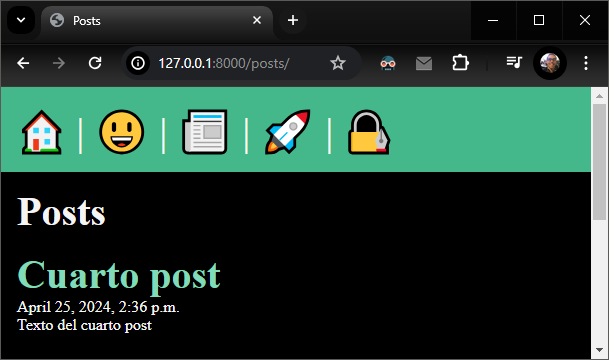
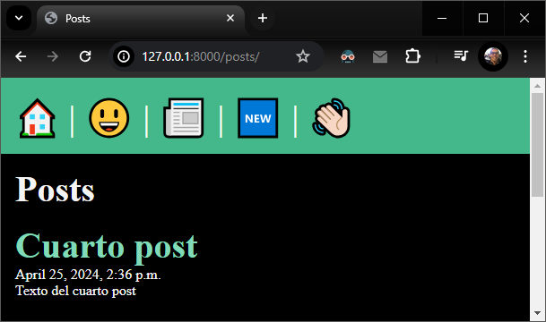
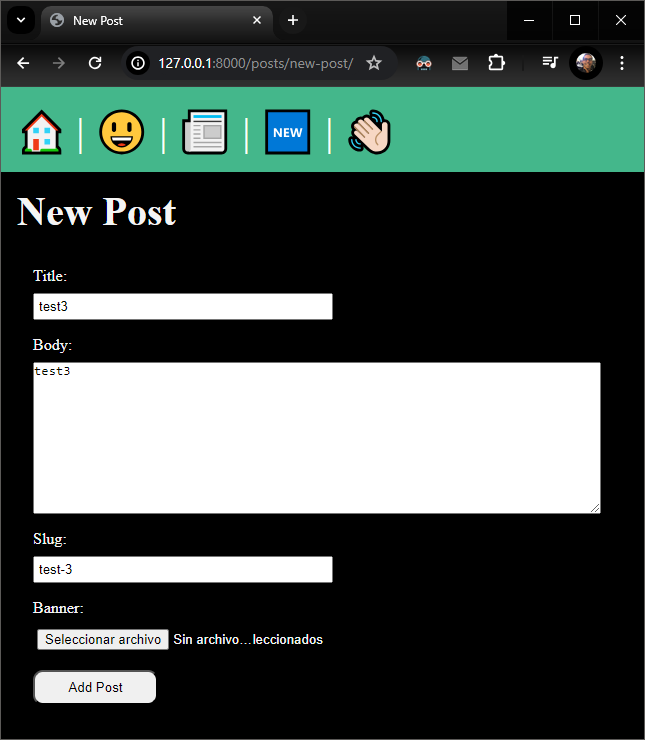
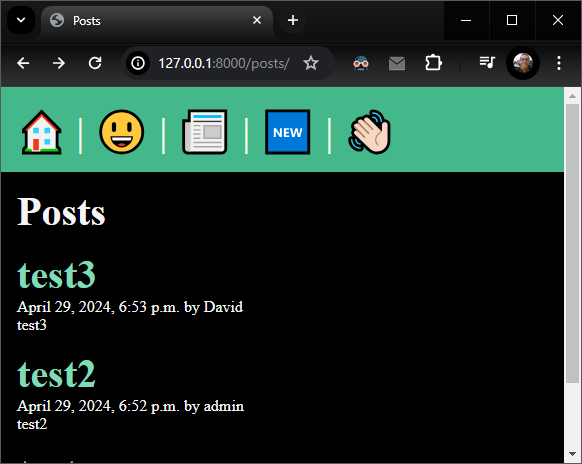

# [Dave Gray - Django Tutorials](https://www.youtube.com/playlist?list=PL0Zuz27SZ-6NamGNr7dEqzNFEcZ_FAUVX)

---

Note: To follow the tutorial playlist and make a new project for each lesson, I made a script called '_**clone_folder_and_increase_version.py**_' that creates a copy of the previous lesson folder and updates version numbers (in folders and files) accordingly (Thanks ChatGPT ♥)

---

## Lesson 0:
- Project creation
- Rendering of html templates
- Config and use of paths and static files (css, js)

Create env (only the first time):

  ```py -m venv venv```

Activate env:

  ```source venv/Scripts/activate```

Install Django (only the first time):

    pip install django

Create a new Django project:

    django-admin startproject lesson0

Start app:

    cd lesson0

    py manage.py runserver

Visit App:

  - http://localhost:8000

To render HTML templates, a 'view' function must be created in views.py file:

    def homepage(request):
      return render(request, 'homepage.html')

To use it, a 'path' must be specified in urls.py file, inside of 'urlpatterns' list:

    path('', views.homepage, name="homepage"),

By default Django will look for 'homepage.html' inside 'templates' folder in the root of the project.

Finally, to be able to use static files, the following code must be added to 'settings.py' file:

    import os # Add this at the top

    # Add this at the bottom of settings.py
    STATICFILES_DIRS = [
      os.path.join(BASE_DIR, 'static'),
    ]

  - Now, static files must be placed into '/static' root folder, and can be referenced from 'homepage.html' by using ' syntax':

      ```<link rel="stylesheet" href="">```

      ```<script src="" defer></script>```


---

## Lesson 1:
- App creation
- App configuration
- Using of namespaced templates
- VSCode Emmet configuration for Django HTML files
- Creation and use of "Base layout" template

Create a new Django app:

    py manage.py startapp posts

Add new 'posts' app to INSTALLED_APPS on settings.py

Add new 'templates/layout.html' file with `````` and  `````` placeholders

Update 'homepage.html' and 'about.html' to extends and use base layout by adding `````` and specifing blocks content.

Also add a new posts/templates/posts/posts.list.html file with ``````

Add posts/urls.py and update lesson1/urls.py to include the posts urls.

Start app:

    cd lesson1

    py manage.py runserver

Visit App:

  - http://localhost:8000
  - http://localhost:8000/about
  - http://localhost:8000/posts


---

## Lesson 2:

- Model and migrations

Create a class called Post inside posts/models.py (must inherit from models.Model)

Define fields (more info: https://docs.djangoproject.com/en/5.0/ref/models/fields/)

Apply base app migrations by running:

    py manage.py migrate

Create migration for new Post model:

    py manage.py makemigrations
  - A new 'posts\migrations\0001_initial.py' file will be created.

Apply migrations:

    py manage.py migrate
  - This creates Post model (_**table**_) on the database.


---

## Lesson 3:

- ORM Intro
- Adding **'\__str\__'** method to Post model to show post title whenever a post is shown:

      def __str__(self):
        return self.title

A quick way to try and play with the Django ORM is by using the shell this way:

    py manage.py shell

From there the Post model can be imported to perform several operations:

    from posts.models import Post

To create a Post object:

    p = Post()

To set values for the attributes:

    p.title = "First Post"
    p.body = "First Post body text"

Now the Post object can be saved into the database:

    p.save()

Finally it's possible to get all posts from the database:

    Post.objects.all()

  - Expected result:

      <QuerySet [<Post: First post>]>

To exit from the shell, execute:

    exit()


---

## Lesson 4:

- Django Admin Introduction
- Admin panel user creation
- Model registration to show it in admin panel
- Django ORM Post model used to retrive ordered posts
- Use of Python code in Jinja HTML templates to itereate and render posts

An user must be created to access to /admin panel:

      py manage.py createsuperuser

  - User created: admin
  - Password: admin123

- Posts can be manipulated by using the admin panel, but first it's requeried to "register" the Post model:
  - Add to '**_posts/admin.py_**', the following lines:


        from .models import Post
        admin.site.register(Post)

  - Next, access to http://localhost:8000/admin
    - A CMS web interface is available to manipulate (CRUD operations available) posts, users and groups.


- To show posts list, posts must be retrieved from the database by using Django ORM, and then passing it to the render method:

      def posts_list(request):
        posts = Post.objects.all().order_by('-date')
        return render(request, 'posts/posts_list.html', { 'posts': posts })
    - By using '-date' param, it will retrive posts in descending order.

- Finally, the HTML template must iterate the posts list to show the posts, it can be done by using a for loop:

      
        <article>
          <h2>{{ post.title }}</h2>
          <p>{{ post.date }}</p>
          <p>{{ post.body }}</p>
        </article>
      


---

## Lesson 5: Pages, URLs & Slugs

- URL path's names (aliases) and using URL name's on anchor tags
- Setting app_name to app url's file
- Using 'slug' Django path converter

Setting _**app_name**_ in _'\posts\urls.py'_ to be able to have the same url 'name' in different _**urls.py**_ app files.
  - To do this, just add a variable with the app name to _'posts/urls.py'_ app file:

        app_name = 'posts'

Setting name to an url path in _'\posts\urls.py'_:

    path('', views.posts_list, name="list")

  - Now, whenever an anchor tags is created, it can use app name and url name, like this:

    ```<a href="">Posts</a>```

Setting url path config in URL in '\posts\urls.py' for use of the post's 'slug':

    path('<slug:slug>', views.post_page, name="page"),

  - First 'slug' term tells Django and slug will be used in URL, second 'slug' term specify the Post model field which will be used as slug for creation of each Post URL.
  - #### Before this works, all posts must have slug field complete with some value like "my-first-post", "another-post", etc. ####

Finally, it's possible now to visit a specific post page specifing the post slug in URL, ex:
  - http://127.0.0.1:8000/posts/first-post

  


---

## Lesson 6: Upload & Display Images

- Update 'settings.py' adding at the bottom:

      MEDIA_URL = 'media/'
      MEDIA_ROOT = os.path.join(BASE_DIR, 'media')

- Create a 'media' root folder.
- Update main 'urls.py' to add:

      from django.conf.urls.static import static
      from django.conf import settings

      urlpatterns = [
        ... # Do not touch this part
      ]

      # Add this:
      urlpatterns += static(settings.MEDIA_URL, document_root=settings.MEDIA_ROOT)

- Install Pillow, that allows to use 'models.ImageFiled' in models:

      pip install Pillow

- Update Post model in 'posts/models.py', adding a new 'banner' field:

      banner = models.ImageField(default='fallback.png', blank=True)

- Make and execute migrations:

      py manage.py makemigrations
      py manage.py migrate

- Go to admin panel and update existing posts adding the value for the banner field (by default 'fallback.png' will be used for all posts)

- Make sure '/media' folder and 'media/fallback.png' file exists.

- Go to 'posts/templates/post_page.html' and add an img tag to show the image of the new 'banner' field

      

- Update CSS file '/static/css/styles.css' adding:

      .banner {
        display: block;
        width: 100%;
        max-width: 800px;
      }


---

## Lesson 7: Adding a new 'Users' app
- App creation:

      py manage.py startapp users

- App registration in 'lesson7/lesson7/settings.py':

      INSTALLED_APPS = [
          ... # Do not touch anything here
          'posts',
          'users' # <-- Add this line
      ]

- Add url path to users app in 'lesson7/lesson7/urls.py' file:

      path('posts/', include('posts.urls')), # <-- Below this line
      path('users/', include('users.urls')), # <-- Add this new line

- Adding a new route path in a new 'users/urls.py' file:

      app_name = 'users'

      urlpatterns = [
          path('register/', views.register, name="register"),
      ]

- Adding a new view for register page in 'users/views.py' file:

      def register(request):
        return render(request, 'users/register.html')

- Creating the register view HTML template in 'users/templates/users/register.html' which extends the base layout:

      

      
        Register a New User
      

      
        <h2>Register a New User</h2>
      


---

## Lesson 8: Adding user registration form
- Updating users register view ('_/users/views.py/_') to be able to create and then validate registration form, by using Django UserCreationForm functionality:

      from django.contrib.auth.forms import UserCreationForm

      def register(request):
          if request.method == 'POST':
              form = UserCreationForm(request.POST)
              if form.is_valid():
                  form.save()
                  return redirect('posts:list')
          else:
              form = UserCreationForm()
          return render(request, 'users/register.html', {'form': form})

- Updating HTML template _'users\templates\users\register.html'_ to include the Django form created (it will also show validations errors, if any occur):

      
        <h1>Register a New User</h1>
        <form action="" class="form-with-validation" method="post">
          
          {{ form }}
          <button class="form-submit">Submit</button>
        </form>
      

  - _****_ is required to allow Django verify that post data is coming from the same application, and be able to manage/avoid _**Cross site reference forgery**_.





---

## Lesson 9: Login Form and User Authentication
- Updated navigation bar to include a login link.
- Updated '**_users/urls.py_**' to include new 'login/' path:

      path('login/', views.login_view, name="login")

- Added '**_users/templates/login.html_**' page (similar to register.html)
- Added a new **_login_view_** method in '**_users/views.py_**' to manage the user login by using **_AuthenticationForm_** and **_login_** Django built-in functionalities:

      from django.contrib.auth.forms import UserCreationForm, AuthenticationForm
      from django.contrib.auth import login

      def login_view(request):
          if request.method == 'POST':
              form = AuthenticationForm(data=request.POST)
              if form.is_valid():
                  login(request, form.get_user())
                  return redirect('posts:list')
          else:
              form = AuthenticationForm()
          return render(request, 'users/login.html', {'form': form})




---

## Lesson 10: User Authorization
#### Added logout functionality:
- Added logout view to '**_users/views.py_**':

      def logout_view(request):
          if request.method == 'POST':
              logout(request)
              return redirect('posts:list')

- Added logout url path to '**_users/urls.py_**':

      path('logout/', views.logout_view, name="logout"),

- Added logout navbar button to layout template '**_templates/layout.html_**':

      <form class="logout" action="" method="post">
        
        <button class="logout-button" aria-label="User Logout" title="User Logout">👋🏻</button>
      </form>

#### Protected route -> New Post:
- Added '_new-post/_' url path to '**_posts/urls.py_**':

      path('new-post/', views.post_new, name="new"),

- Added a new html template for the new post page: '**_posts/templates/post_new.html_**'.
- Added a new navbar link to the new route '**_posts/new-post_**'.
- Added the view for new post page with the '**_@login_required()_**' decorator that will redirect the user if he is not logged in:


      @login_required(login_url='/users/login/')
      def post_new(request):
        return render(request, 'posts/post_new.html')

- URL when an unauthenticated user try to access to '_/posts/new-post_':




#### Using the '_next_' query param (if it exists) to redirect the user to the page from where he was redirect to login (surely because the route was protected):

- Updating the users login page to save the '_next_' parameter, in a hidden input, if it exists:

      
        <h1>Login User</h1>
        <form action="" class="form-with-validation" method="post">
          
          {{ form }}
          
            <input type="hidden" name="next" value="{{ request.GET.next }}" />
          
          <button class="form-submit">Submit</button>
        </form>
      

- Updating the login_view functionality to redirect the user to the correct page depending on if the _next_ parameter exists in the url:

      def login_view(request):
          ...
              if form.is_valid():
                  login(request, form.get_user())
                  if 'next' in request.POST:
                      return redirect(request.POST.get('next'))
                  else:
                      return redirect('posts:list')
          else:
              ...

- After a successful login:


#### Conditional rendering of menu options depending on if the user is logged in:
- Updated navbar using '_**if user.is_authenticated**_':

      <nav>
        <a href="">
          <span role="img" aria-label="Home" title="Home">🏠</span>
        </a> |
        <a href="">
          <span role="img" aria-label="About" title="About">😃</span>
        </a> |
        <a href="">
          <span role="img" aria-label="Posts" title="Posts">📰</span>
        </a> |

        
          <a href="">
            <span role="img" aria-label="New Post" title="New Post">🆕</span>
          </a> |
          <form class="logout" action="" method="post">
            
            <button class="logout-button" aria-label="User Logout" title="User Logout">👋🏻</button>
          </form>
        
          <a href="">
            <span role="img" aria-label="Register" title="Register">🚀</span>
          </a> |
          <a href="">
            <span role="img" aria-label="Login" title="Login">🔏</span>
          </a>
        
      </nav>

- User not authenticated:



- User authenticated:




---

## Lesson 11: Django Forms

#### Added a new Author field to post model

- Delete all posts since now the authenticated user will be the author each time he creates a new post.
- Update the Post model to include a new foreign key field Author related to the user:

      from django.contrib.auth.models import User

      class Post(models.Model):
        ... other fileds...
        author = models.ForeignKey(User, on_delete=models.CASCADE, default=None)
- Execute makemigrations and migrate to update the database table for Post model.

#### Added a new _CreatePost_ class inside a new '_posts/forms.py_' file
- It extends from **_forms.ModelForm_** in django forms:

      from django import forms

      class CreatePost(forms.ModelForm):
        class Meta:
          model = models.Post
          fields = ['title','body','slug','banner']

#### Updated post_new view in '_posts/views.py_' to instantiate and use _CreatePost_ class and pass it to the post_new HTML template:

      @login_required(login_url='/users/login/')
      def post_new(request):
        if request.method == 'POST':
          form = CreatePost(request.POST, request.FILES)
          if form.is_valid():
            new_post = form.save(commit=False)
            new_post.author = request.user
            new_post.save()
            return redirect('posts:list')
        else:
          form = CreatePost()
        return render(request, 'posts/post_new.html', {'form': form})

#### Updated the post_new template to show the new post form:

        <section>
          <h2>New Post</h2>
          <form action="" method="post" class="form-with-validation" enctype="multipart/form-data">
            
            {{ form }}
            <button class="form-submit" type="submit">Add Post</button>
          </form>
        </section>

    - Very important: Add _**enctype="multipart/form-data"**_ to form meta tag, so it can be used to correctly upload the selected image.

#### Updated the _post_page_ and/or the _post_list_ HTML template to show the author of the each post:

      <p>{{ post.date }} by {{ post.author }}</p>



